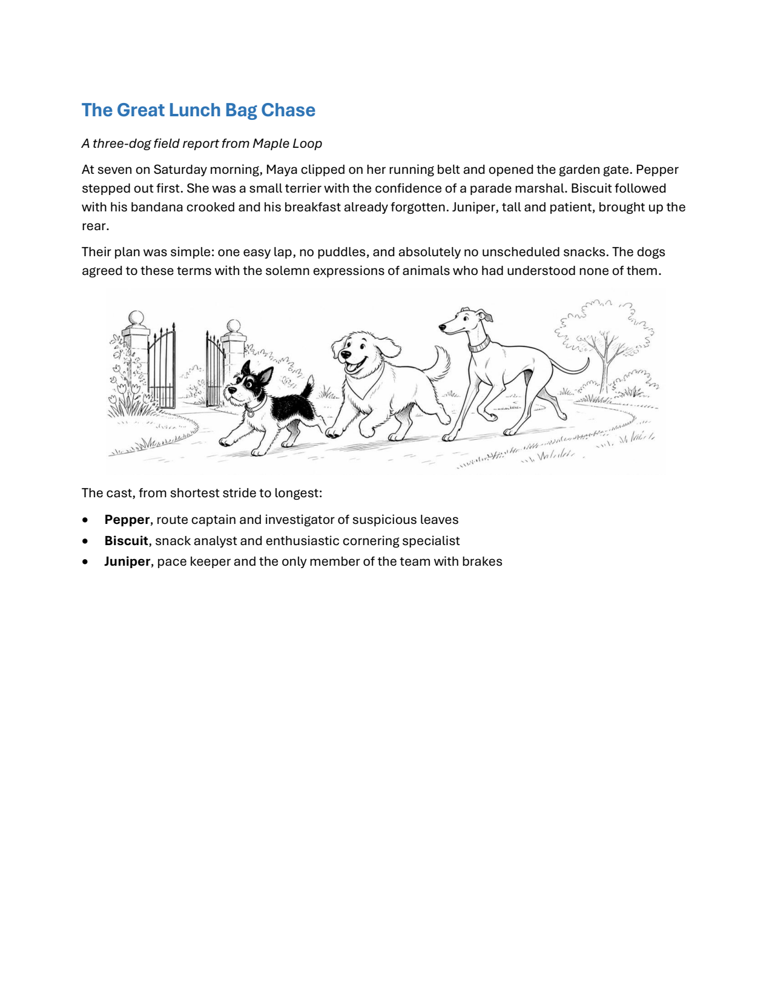

# markdown-docx

`markdown-docx` turns constrained Markdown into editable Word `.docx` documents built from real Word paragraphs, tables, images, styles, and sections. It is a strict, predictable CLI designed for both people and coding agents.

The Markdown stays readable in normal renderers. Word-specific layout and style settings live in invisible reserved HTML comments. Unsupported input produces a stable, line-aware error instead of an approximate document.

## Prerequisite

`markdown-docx` is designed to be used with [`uv`](https://docs.astral.sh/uv/getting-started/installation/). Install `uv` before continuing. The documented workflows use `uvx` to run the tool without requiring a global installation.

## Quick start with an agent

Install the managed agent skill:

```powershell
uvx markdown-docx skill install
```

Then use `$markdown-docx` in Codex, Claude Code, or another agent harness that supports skills:

> Use $markdown-docx to create a project brief. Keep the source readable as normal Markdown and save the editable DOCX beside it.

The skill teaches the agent how to inspect the format and templates, write valid document Markdown, render the document safely, and handle structured results.

## What it creates

Markdown stays readable, while the generated document remains easy to edit in Word.



See the [showcase Markdown](sample/showcase.md) and its [editable Word output](sample/showcase.docx) for a complete example.

## Use the CLI directly

Render a document without installing the package globally:

```powershell
uvx markdown-docx document.md document.docx
```

When the output path is omitted, the tool writes a `.docx` beside the input Markdown file:

```powershell
uvx markdown-docx document.md
```

Inspect the supported format or the styles in the default template:

```powershell
uvx markdown-docx --syntax
uvx markdown-docx --list-styles
uvx markdown-docx --list-table-styles
```

To install the command as a persistent tool instead:

```powershell
uv tool install markdown-docx
```

The examples below continue to use `uvx markdown-docx` so they work without a global installation.

## How the format works


The document model has four core rules:

1. Standard Markdown contains the document content.
2. Optional document metadata may appear once at the beginning of the file.
3. Table, image, page-break, and section directives appear immediately before the content they affect.
4. Word templates own detailed formatting such as styles, spacing, colors, borders, and numbering.

Headings organize content. They never create Word sections.

A minimal document needs no Word metadata:

```markdown
# Project brief

This document was generated from readable Markdown.

## Goals

- Make the launch process repeatable
- Give every deliverable a clear owner
- Keep the final document editable

| Deliverable | Owner | Status |
| --- | --- | --- |
| Launch plan | Maya | Ready |
| Support guide | Jordan | In progress |
```

Render it with:

```powershell
uvx markdown-docx project-brief.md project-brief.docx
```

If no `--template` is provided, the packaged blank template supplies the default styles and document settings.

## Use a Word template

A custom template lets an organization control styles, theme data, fonts, numbering definitions, and section defaults while the Markdown remains focused on content. Inspect a template before writing the document, then use only the styles it provides.

The template must be a blank, macro-free `.docx` or `.dotx` formatting template. DOTX input produces a real DOCX output and leaves the source template unchanged. Macro-enabled DOCM and DOTM files are unsupported. Populated headers and footers remain unsupported. Inspect it before writing Markdown that refers to its style names:

```powershell
uvx markdown-docx --inspect-template --template formatting.docx
uvx markdown-docx --list-styles --template formatting.docx
uvx markdown-docx --list-table-styles --template formatting.docx
```

Then render with the template:

```powershell
uvx markdown-docx report.md report.docx --template formatting.docx
```

The template remains unchanged. It must not contain:

- Non-whitespace body text
- Body tables
- Body images or drawings
- Nonempty headers or footers

Each configured style must exist and have the correct Word style type. Body and heading font overrides modify the mapped paragraph styles. The monospace override applies to code blocks and inline code. Sizes, colors, spacing, borders, and other typography remain owned by the template.

## Customize a document

Word-specific settings use reserved `markdown-docx` HTML comments. Normal Markdown renderers hide these comments and continue to display the document content.

Document metadata sets document-wide defaults:

| Key | Purpose |
| --- | --- |
| `page_size` | Select `letter`, `legal`, `a4`, or custom dimensions |
| `orientation` | Select portrait or landscape orientation |
| `margins` | Set the top, right, bottom, and left margins |
| `styles` | Map Markdown constructs to Word style names |
| `fonts` | Set theme body and heading fonts, plus a fixed monospace font |

Content directives control the following block:

| Directive | Purpose |
| --- | --- |
| `section` | Start a next-page Word section with layout overrides |
| `table` | Set table style, width, alignment, and column ratios |
| `image` | Set standalone image width and alignment |
| `page-break` | Start the next content block on a new page |

Only HTML comments beginning with `markdown-docx` are accepted. All other raw HTML and HTML comments are errors. Metadata uses strict YAML. Duplicate keys, unknown keys, invalid types, unitless lengths, and misplaced comments are errors.

Run `uvx markdown-docx --syntax` for the complete schema, accepted values, and examples.

### Document settings

Document metadata may appear once. It must be the first non-whitespace content:

```markdown
<!-- markdown-docx
document:
  page_size: letter
  orientation: portrait
  margins:
    top: 0.75in
    right: 0.75in
    bottom: 0.75in
    left: 0.75in
  fonts:
    body: Aptos
    headings: Aptos Display
    monospace: Consolas
-->

# Project brief

This remains ordinary Markdown.
```

Named page sizes are `letter`, `legal`, and `a4`. Custom page sizes use nominal portrait dimensions. Their width must not exceed their height. Lengths accept `in`, `cm`, `mm`, and `pt`. Margins must leave a positive usable page area.

The `styles` mapping assigns Word paragraph and table styles to semantic Markdown constructs. Ordered and unordered list styles are arrays, with one Word style for each supported nesting depth.

`fonts.body` and `fonts.headings` set the document theme's Latin body and heading fonts. Word's theme font settings show these choices. Mapped paragraph styles and their linked character styles inherit from the theme, so a later theme font change updates existing text and new paragraphs. Font names are not applied to individual body or heading runs. Body overrides also update the default paragraph style and default run font reference. Omitted body or heading overrides preserve that part of the template theme and its styles.

`fonts.monospace` stays explicit for inline code and code blocks because Word has no monospace theme font slot. Templates must use distinct styles for simultaneously overridden body, heading, and code roles. Conflicting mappings report `template_font_style_conflict`. A template without a theme receives the packaged theme when body or heading overrides are requested. A malformed theme reports `template_theme_invalid`.

Theme colors, effects, East Asian fonts, complex script fonts, and supplemental script mappings are preserved. These overrides do not embed or install fonts. Word may substitute fonts that are unavailable on the rendering machine.

### Sections and page breaks

A section directive starts a next-page Word section before the following content block:

```markdown
<!-- markdown-docx
section:
  orientation: landscape
  margins:
    top: 0.75in
    right: 0.75in
    bottom: 0.75in
    left: 0.75in
-->

## Landscape analysis
```

Each section starts from the document defaults and applies its own overrides. It does not inherit omitted values from the preceding section. Reset to the document defaults with:

```markdown
<!-- markdown-docx
section: default
-->
```

To insert a page break without creating a section:

```markdown
<!-- markdown-docx: page-break -->

## Appendix
```

### Tables

Standard pipe tables become editable Word tables. Put optional table metadata immediately before the table:

```markdown
<!-- markdown-docx
table:
  style: Table Grid
  alignment: center
  width: page
  column_widths: [3, 1, 1]
-->

| Item | Count | Price |
| --- | ---: | ---: |
| Widget | 2 | $10 |
```

The first Markdown row is the semantic header row. Cell alignment follows the Markdown delimiter row. `column_widths` contains positive ratios and must match the column count. `width: page` uses the active section's usable width. `width: auto` lets Word size the table unless ratios are supplied.

Merged cells, nested tables, fixed row heights, repeated-header controls, and per-cell border or fill metadata are not supported.

### Repeating table headers

Pipe-table header rows repeat automatically when a table spans pages in Word. Body rows are not marked as headers. No Markdown directive is required. The underlying library exposes `row.repeat_as_header` for callers that need explicit control.

## Footnotes

Footnotes use the named `[^label]` and `[^label]: note text` extension from mdit-py-plugins. Labels are case-sensitive. Forward references, formatted text, links, hard breaks, and multiple note paragraphs are supported. Indent later paragraphs by four spaces. Each label must be defined and referenced exactly once. Empty notes are allowed. Undefined labels, duplicate definitions, unused definitions, and repeated references produce line-aware errors. Notes cannot contain images, lists, tables, headings, code blocks, metadata, or nested notes. References in image labels are rejected. References render as native Word notes with automatic numbering. No custom directive is required.

```markdown
A statement with a source[^source].

[^source]: The source or explanation with **emphasis**.

    A second paragraph with a [link](https://example.com).
```

## Images

Relative paths resolve from the Markdown file's directory:

```markdown
Text before  text after.
```

Put metadata immediately before a standalone image:

```markdown
<!-- markdown-docx
image:
  width: 40%
  alignment: center
-->

```

Widths accept `in`, `cm`, `mm`, `pt`, or a percentage of the active section's usable width. Images preserve aspect ratio. Natural-size images are clamped to the usable width. An explicit physical width that exceeds the usable width is an error.

HTTP and HTTPS images use timeouts, a 25 MiB download limit, content-type validation, a 50 megapixel decode limit, and one download per unique URL. Reject remote images for offline builds or untrusted input:

```powershell
uvx markdown-docx report.md --no-remote-images
```

### Lists

Ordered and unordered lists may be mixed and nested. Each list type maps to one Word paragraph style per nesting depth:

```yaml
styles:
  ordered_list:
    - List Number
    - List Number 2
    - List Number 3
  unordered_list:
    - List Bullet
    - List Bullet 2
    - List Bullet 3
```

A list deeper than the configured style array is an error. Each mapped style must reference a native numbering definition in the template, directly or through an inherited paragraph style.

Ordered lists begin at the number written on their first item, including `0`. Subsequent markers follow normal Markdown meaning and do not change the sequence. Each separate list restarts independently. Use its first marker to continue from a chosen number after intervening content.

Indented paragraphs within an item become separate, unnumbered Word paragraphs aligned with the item text. Nested lists get their own sequence. Returning to the outer list continues its numbering.

```markdown
3. Third item

   More detail about the third item.

   - A nested bullet

4. Fourth item

An ordinary paragraph separates lists.

1. A new list starts at one.
```

## Styles and supported content

The packaged template provides these default style mappings. Supplied templates may use different style names.

| Content | Default Word style |
| --- | --- |
| Paragraph | `Normal` |
| Headings | `Heading 1` through `Heading 6` |
| Blockquote | `Quote` |
| Code block | `Code Block` |
| Ordered lists | `List Number` through `List Number 3` |
| Unordered lists | `List Bullet` through `List Bullet 3` |
| Table | `Table Grid` |

The current release supports:

- ATX headings from `#` through `######` and Setext headings
- Paragraphs and standard soft or hard line breaks
- Emphasis, strong emphasis, strikethrough, superscript, subscript, and inline backtick code
- Markdown links with formatted labels and optional titles, plus bare URL links
- Fenced and indented code blocks
- Blockquotes containing paragraphs
- Ordered and unordered lists, including mixed nesting and rich item content
- Pipe tables with inline text formatting
- Local and remote inline images
- Standalone images with width and alignment metadata

The following syntax is intentionally unsupported:

- Raw HTML and non-reserved HTML comments
- Horizontal rules
- Task lists
- Images inside table cells or blockquotes
- Arbitrary Markdown extensions

Links such as `[link text](https://example.com)` and bare URLs become native, clickable, editable Word hyperlinks. Labels preserve bold, italic, strikethrough, superscript, subscript, inline code, and line breaks. Optional Markdown titles become Word tooltips. Links work in paragraphs, headings, blockquotes, lists, and table cells. Reference links, angle-bracket autolinks, email links, relative file links, and linked inline images are supported wherever their content is allowed. Destinations are stored without fetching them. Relative file links are resolved by Word relative to the output document. Empty destinations are rejected. Every heading creates a bookmark. Link to its slug with `[Details](#details)`, including before the heading. Slugs use plain heading text and image labels, normalized to NFC and lowercase. Punctuation is removed except underscores and hyphens. Whitespace becomes a hyphen. Empty slugs use `section`. Duplicates receive `-1`, `-2`, and later available suffixes in document order. Unicode and percent-encoded fragments are supported. Fragments must match the slug exactly. Missing targets produce `internal_link_unresolved` with the source line. Word bookmark names are generated separately to fit Word constraints.

Use `~~deleted~~` for strikethrough, `x^2^` for superscript, and `H~2~O` for subscript. Setext headings use `===` for level one and `---` for level two on the next line. Indent code by four spaces to create a code block.

List items can contain paragraphs, headings, code blocks, blockquotes, tables, and images. Indent each nested block under its list item. Only the first item paragraph receives a number or bullet. Later paragraphs and blocks align with its text. A table in a list item keeps that indentation through the public ps-python-docx APIs.

```markdown
Read the [**project documentation**](https://example.com/docs "Read the guide").
Contact [the team](mailto:team@example.com).
```

Image alt text becomes the Word image description. Optional Markdown image titles become image titles, for example ``. This applies to standalone, inline, and linked images. Formatting markers in descriptions are removed while their text is preserved. Empty descriptions stay empty and do not automatically mark images as decorative. The Markdown parser treats an empty image title as absent. Descriptions belong to each placed image, so repeated uses of the same file can have different alt text.

## Automation and safety

### Structured results and overwrite safety

Use `--json` for one complete machine-readable result:

```powershell
uvx markdown-docx report.md report.docx --json
```

A successful result contains the input path, output path, template identifier, section count, and warnings. It does not report a page count. DOCX files do not have a reliable intrinsic page count until a compatible layout engine paginates them.

The CLI refuses to overwrite an existing output. Add `--force` only when replacement is intended:

```powershell
uvx markdown-docx report.md report.docx --force --json
```

### Remote images and stdin

Use `--no-remote-images` for offline builds or untrusted Markdown. Download assets ahead of time and use local paths when reproducible builds matter.

For stdin, provide both an output path and a base directory:

```powershell
Get-Content report.md | uvx markdown-docx --input - --output report.docx --base-dir .
```

## Reference

Useful discovery and metadata commands:

```powershell
uvx markdown-docx --help
uvx markdown-docx --syntax
uvx markdown-docx --inspect-template --template formatting.docx
uvx markdown-docx --list-styles --template formatting.docx
uvx markdown-docx --list-table-styles --template formatting.docx
uvx markdown-docx --about
uvx markdown-docx --version
```

Exit codes:

| Code | Meaning |
| ---: | --- |
| `0` | Success |
| `2` | Usage or input error |
| `3` | Markdown or metadata parse error |
| `4` | Template or style error |
| `5` | Image or asset error |
| `6` | Unsupported Markdown or feature |
| `7` | DOCX rendering error |
| `8` | Unexpected internal error |

### Manage the agent skill

The standard location is `~/.agents/skills/markdown-docx/SKILL.md`. Inspect the installed skill without changing it:

```powershell
uvx markdown-docx skill status
uvx markdown-docx skill status --json
```

Normal commands synchronize an already-installed managed skill when it is eligible. Synchronization is local. It does not query a package index, refresh uv's cache, or update the CLI. Missing, unmanaged, modified, unverifiable, equal-version, and newer skills are preserved.

To replace managed edits intentionally or recover an older managed skill:

```powershell
uvx markdown-docx skill install --force
```

Install `--force` still refuses unmanaged content and never downgrades a newer skill. Custom directories require explicit updates:

```powershell
uvx markdown-docx skill install --skills-dir PATH
uvx markdown-docx skill status --skills-dir PATH
uvx --from . markdown-docx skill install
```

Remove the skill with `uvx markdown-docx skill remove`. Removal refuses unmanaged content and extra files unless `--force` is supplied. All skill commands accept `--skills-dir` and `--json`. Skill commands never trigger automatic synchronization. Maintenance notices go to stderr and leave JSON stdout intact.

See [skill lifecycle metadata and decisions](docs/skill-management.md) for the integrity format, version decisions, and recovery rules.

## Examples

- [Showcase Markdown source](sample/showcase.md)
- [Generated editable Word document](sample/showcase.docx)
- [Rendered first page](sample/assets/showcase-page-1.png)
- [Workflow illustration](sample/assets/word-workflow.png)

The showcase opens with an illustrated three-dog story, then exercises supported text, list, table, image, page-break, and section behavior in a dedicated capability lab.

Regenerate it from a repository checkout:

```powershell
uvx --refresh --from . markdown-docx sample\showcase.md sample\showcase.docx --force
```

## Design and compatibility

Both development installs and published wheels use `ps-python-docx==1.3.8` from PyPI. It retains the `docx` import package and replaces the upstream `python-docx` distribution. Use `uv sync --locked --all-groups` and `uv run markdown-docx` when working from source. CI and the release workflow test a clean wheel installation from PyPI.

Production code uses only the public `docx` APIs provided by `ps-python-docx` 1.3.8. Native hyperlinks, image descriptions and titles, theme fonts, style references, linked styles, and document defaults use public library APIs. `src/markdown_docx/hyperlinks.py` applies Markdown styling through the public hyperlink API. Tests enforce the public API boundary and inspect saved image metadata, hyperlinks, theme data, style inheritance, and effective font selection. See [public API capabilities](docs/public-api-capabilities.md) for the decision record.

The visual CI job also renders font regression documents through LibreOffice using installed Liberation fonts. It verifies the fonts recorded in the PDF, then changes only the theme and checks that the rendered fonts follow it. To run the same check through installed Microsoft Word with Aptos and Aptos Display on Windows:

```powershell
$env:MARKDOWN_DOCX_FONT_RENDERER="word"
uv run pytest tests/test_font_rendering.py
```

This optional check uses `uvx office-export` and requires the named fonts to be available to Word. A substituted font fails the test.

Word is the primary compatibility target. LibreOffice Writer is used as a visual smoke-test engine. Differences in pagination or font metrics can occur between layout engines.

## Development

Install the development environment and run the checks:

```powershell
$env:UV_LINK_MODE="copy"
uv sync --locked --all-groups
uv run pytest
uv run ruff check .
uv run ruff format --check .
uv run mypy
```

Build and validate distributions:

```powershell
uv build
uv run twine check dist/*
```
