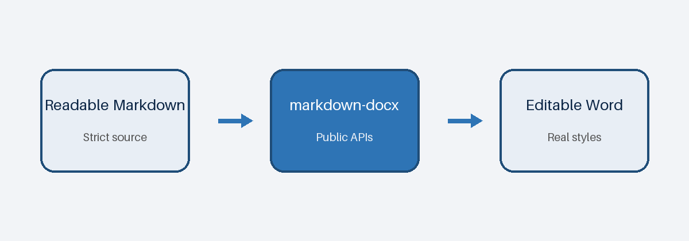

<!-- markdown-docx
document:
  page_size: letter
  orientation: portrait
  margins:
    top: 0.85in
    right: 0.9in
    bottom: 0.85in
    left: 0.9in
  fonts:
    body: Calibri
    headings: Calibri
    monospace: Consolas
-->

# markdown-docx 1.0.0

Predictable, editable Word documents from readable Markdown.

This showcase demonstrates **strong text**, *emphasis*, and `inline code`.\
This sentence follows an explicit hard line break.

> The source remains ordinary Markdown while invisible comments carry Word layout instructions.
>
> Templates and semantic styles own the visual system.

## Text hierarchy

Headings do not create pages or sections. They map directly to the configured Word paragraph styles.

### Heading level three

#### Heading level four

##### Heading level five

###### Heading level six

## Fenced code

```python
from pathlib import Path

output = Path("brief.docx")
print(output)
```

## Mixed nested lists

- Markdown remains readable
  1. Metadata stays invisible
     - Validation stays strict
- Word content remains editable

1. Inspect the syntax
   - Inspect the template
2. Render the document
3. Review the editable result

<!-- markdown-docx: page-break -->

## Native table

<!-- markdown-docx
table:
  style: Table Grid
  alignment: center
  width: page
  column_widths: [3, 1, 1]
-->

| Capability | Source | Output |
| :--- | :---: | ---: |
| Headings | Markdown | Word styles |
| Tables | Pipe syntax | Native table |
| Images | Local or remote | Inline drawing |

## Standalone image

<!-- markdown-docx
image:
  width: 82%
  alignment: center
-->


<!-- markdown-docx: page-break -->

# Explicit page break

This heading begins after a page break, but it remains in the same Word section.

An inline image behaves like a character in its paragraph: 

<!-- markdown-docx
section:
  orientation: landscape
  margins:
    top: 0.75in
    right: 0.75in
    bottom: 0.75in
    left: 0.75in
-->

# Landscape section

Each section starts from the document defaults, then applies the declared overrides.

<!-- markdown-docx
table:
  alignment: center
  width: page
  column_widths: [2, 2, 2, 2]
-->

| Boundary | Page size | Orientation | Inheritance |
| :--- | :---: | :---: | ---: |
| Document | Letter | Portrait | Defaults |
| Analysis | Letter | Landscape | Defaults plus overrides |
| Reset | Letter | Portrait | Document defaults |

<!-- markdown-docx
section: default
-->

# Back to document defaults

The final section returns to the original portrait geometry. The output remains a normal editable `.docx` file.
