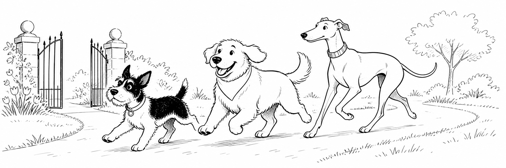
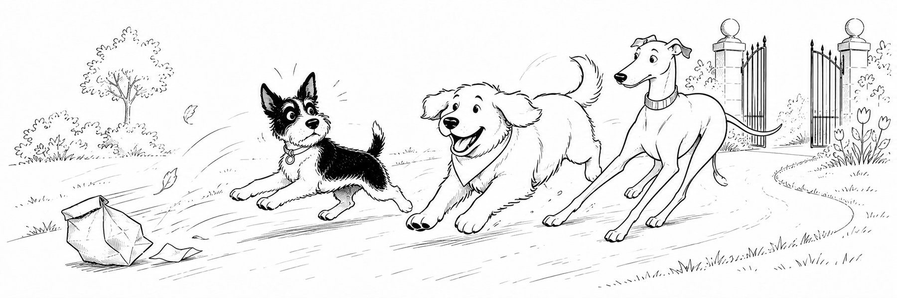
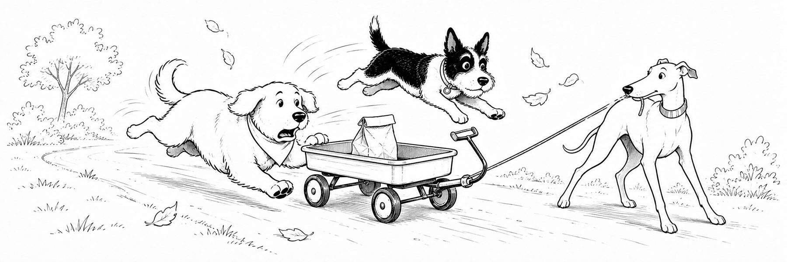
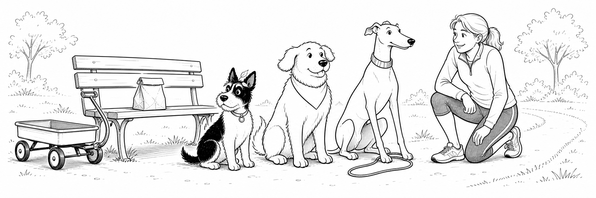
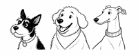
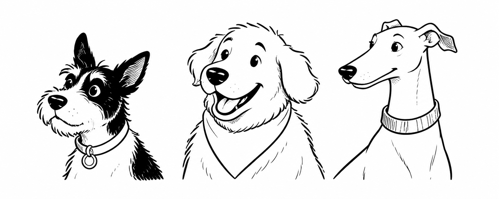

<!-- markdown-docx
document:
  page_size: letter
  orientation: portrait
  margins:
    top: 0.85in
    right: 0.9in
    bottom: 0.85in
    left: 0.9in
  styles:
    paragraph: Normal
    headings:
      1: Heading 1
      2: Heading 2
      3: Heading 3
      4: Heading 4
      5: Heading 5
      6: Heading 6
    blockquote: Quote
    code_block: Code Block
    ordered_list: [List Number, List Number 2, List Number 3]
    unordered_list: [List Bullet, List Bullet 2, List Bullet 3]
    table: Table Grid
  fonts:
    body: Calibri
    headings: Calibri
    monospace: Consolas
-->

# The Great Lunch Bag Chase

*A three-dog field report from Maple Loop*

At seven on Saturday morning, Maya clipped on her running belt and opened the garden gate. Pepper stepped out first. She was a small terrier with the confidence of a parade marshal. Biscuit followed with his bandana crooked and his breakfast already forgotten. Juniper, tall and patient, brought up the rear.

Their plan was simple: one easy lap, no puddles, and absolutely no unscheduled snacks. The dogs agreed to these terms with the solemn expressions of animals who had understood none of them.

<!-- markdown-docx
image:
  width: 92%
  alignment: center
-->


The cast, from shortest stride to longest:

- **Pepper**, route captain and investigator of suspicious leaves
- **Biscuit**, snack analyst and enthusiastic cornering specialist
- **Juniper**, pace keeper and the only member of the team with brakes

<!-- markdown-docx: page-break -->

## Chapter One: A Bag on the Breeze

Maple Loop was quiet enough to hear three sets of paws tapping the path. Pepper held a tidy line. Juniper floated beside her. Biscuit zigzagged between every interesting smell as if he were stitching the park together.

Then a gust lifted a paper lunch bag from a bench.

The bag bounced once. A napkin escaped. Biscuit's ears rose like flags.

> “Steady,” Maya called.
>
> The wind, which had not attended obedience class, pushed the bag downhill.

Biscuit changed course. Pepper changed her opinion of the morning. Juniper changed from a jog to the long, careful stride she reserved for emergencies involving Biscuit.

<!-- markdown-docx
image:
  width: 5.9in
  alignment: left
-->


Pepper issued one sharp bark. It meant *hold formation*, although Biscuit interpreted it as **excellent idea, go faster**. Juniper made a third interpretation, which was `prepare to improvise`.

<!-- markdown-docx: page-break -->

## Chapter Two: The Wagon Problem

The runaway bag dropped neatly into a little park wagon. The wagon paused at the top of the slope. For one hopeful second, everybody else paused too.

Then Biscuit bumped it.

The wagon rolled. Biscuit scrambled. Pepper launched herself over the handle. Juniper reached the loose rope and leaned back with all four feet. Leaves flew past like tiny spectators.

<!-- markdown-docx
image:
  width: 15cm
  alignment: right
-->


The rescue took three seconds. The explanations took longer:

- Juniper stopped the wagon.
   - Pepper confirmed that the lunch bag was still closed.
      - Biscuit confirmed that it still smelled like lunch.
- Maya returned the bag to the bench.
   - Pepper supervised the handoff.
      - Juniper kept one paw on the wagon rope.
- Biscuit sat down before anyone asked him to.

He looked so virtuous that even Pepper found it suspicious.

<!-- markdown-docx: page-break -->

## Chapter Three: Innocent Until Dinner

The owner of the lunch returned from the water fountain and thanked the unlikely rescue team. Maya apologized for the commotion. Juniper accepted praise with dignity. Pepper accepted a scratch behind the ears. Biscuit watched the bag with professional concern.

<!-- markdown-docx
image:
  width: 145mm
  alignment: center
-->


The final incident record was brief.

<!-- markdown-docx
table:
  style: Table Grid
  alignment: center
  width: page
  column_widths: [1.2, 2.2, 2.2, 2.2]
-->

| Moment | Pepper | Biscuit | Juniper |
| :--- | :--- | :---: | ---: |
| First gust | **Alert** | *Delighted* | `steady` |
| Wagon rolls | Leaps | Scrambles | Brakes |
| Bag returned | Supervises | Hopes | Succeeds |

Maya called the outing a success. They had completed one lap, helped a stranger, and learned a useful lesson. The dogs remembered the lap. Maya remembered the stranger. Biscuit remembered the sandwich.

The official team portrait  was taken before anyone mentioned the word *lunch* again.\
That is why all three dogs appear to be listening.

<!-- markdown-docx: page-break -->

# Capability Lab

Everything after this point is intentionally functional. It exercises the portable document features in `markdown-docx` 0.1.0 while remaining readable as ordinary Markdown.

## Text and hierarchy

This paragraph contains **strong text**, *emphasis*, ***strong emphasis***, and `inline code`. It begins on one source line
and continues through a soft source break that becomes a normal space.

This line ends with an explicit hard break.\
This sentence begins on the next line in the same Word paragraph.

### Heading level three

#### Heading level four

##### Heading level five

###### Heading level six

> A blockquote uses the configured `Quote` paragraph style.
>
> A second quoted paragraph confirms that consecutive quote blocks remain editable text.

## Fenced code

```python
from pathlib import Path

source = Path("showcase.md")
target = source.with_suffix(".docx")
print(target)
```

<!-- markdown-docx: page-break -->

## List kinds and depths

- Unordered level one
   - Unordered level two
      - Unordered level three

1. Ordered level one
   1. Ordered level two
      1. Ordered level three

- Mixed unordered parent
   1. Ordered child
      1. Ordered grandchild

1. Mixed ordered parent
   - Unordered child
      - Unordered grandchild

<!-- markdown-docx
section:
  page_size: a4
  orientation: portrait
  margins:
    top: 18mm
    right: 18mm
    bottom: 18mm
    left: 18mm
-->

# A4 Layout Lab

This next-page section uses A4 paper and millimetre margins. The first table keeps automatic width and aligns to the left. It also places strong, emphasized, nested, and code-formatted text inside native table cells.

<!-- markdown-docx
table:
  alignment: left
  width: auto
-->

| Feature | Live example |
| :--- | :--- |
| Strong | **bold cell text** |
| Emphasis | *italic cell text* |
| Code | `cell_code()` |
| Nested | ***bold italic cell text*** |

The next illustration has no image metadata. Its large natural width is clamped to the usable page width by the renderer.



<!-- markdown-docx
section:
  page_size: legal
  orientation: landscape
  margins:
    top: 1.5cm
    right: 1.5cm
    bottom: 1.5cm
    left: 1.5cm
-->

# Legal Landscape Lab

This section uses legal paper in landscape orientation with centimetre margins. Its table is right aligned, fills the usable page width, and uses equal default column widths because no ratios are supplied.

<!-- markdown-docx
table:
  alignment: right
  width: page
-->

| Document scope | Text scope | Layout scope | Asset scope |
| :--- | :---: | :---: | ---: |
| Styles and fonts | Rich inline runs | Sections and breaks | Local and remote loading |
| Letter, legal, A4, custom | Quotes, code, lists | Margins and orientation | Width and alignment |

The illustration below is physically sized in centimetres and aligned to the right.

<!-- markdown-docx
image:
  width: 15cm
  alignment: right
-->


<!-- markdown-docx
section:
  page_size:
    width: 504pt
    height: 720pt
  orientation: portrait
  margins:
    top: 54pt
    right: 54pt
    bottom: 54pt
    left: 54pt
-->

# Custom Page Lab

This section is seven by ten inches, expressed entirely in points. Its illustration is also sized in points and aligned to the right.

<!-- markdown-docx
image:
  width: 360pt
  alignment: right
-->


## Environment-dependent coverage

The portable showcase uses relative local image paths. Automated tests cover absolute local paths, remote downloads, remote opt-out behavior, cache reuse, structured errors, standard input, custom templates, overwrite protection, and command-line exit codes.

<!-- markdown-docx
table:
  alignment: center
  width: page
  column_widths: [1, 2]
-->

| Coverage location | Responsibilities |
| :--- | :--- |
| This document | Portable Markdown, Word layout metadata, native content, and local images |
| Automated suite | Machine-dependent paths, network behavior, cache behavior, CLI modes, and failure contracts |

<!-- markdown-docx
section: default
-->

# Back to Document Defaults

The final section returns to letter paper, portrait orientation, inch-based margins, and the document-level style and font mappings.

The generated file remains a normal editable `.docx`. Headings, paragraphs, quotes, code, lists, tables, images, page breaks, and sections are all native Word content.
